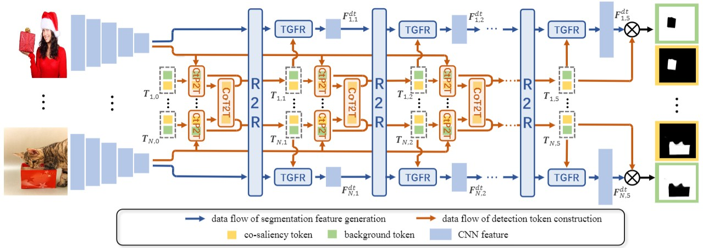
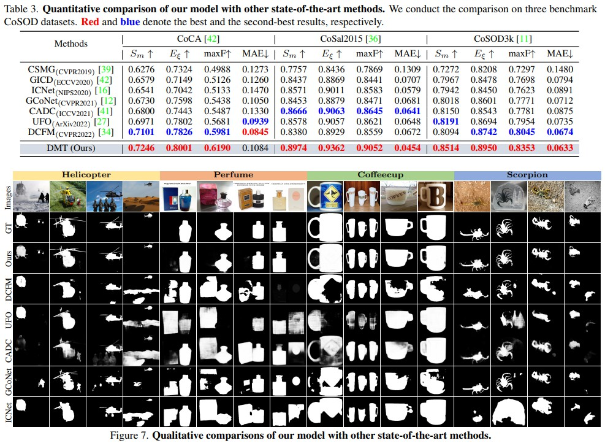

# DMT
Code release for the CVPR 2023 paper `"Discriminative Co-Saliency and Background Mining Transformer for Co-Salient Object Detection"`.



## Abstract
Most previous co-salient object detection works mainly focus on extracting co-salient cues via mining the consistency relations across images while ignore **explicit** exploration of background regions. In this paper, we propose a Discriminative co-saliency and background Mining Transformer framework (DMT) based on several economical multi-grained correlation modules to **explicitly** mine both co-saliency and background information and effectively model their discrimination. Specifically, we first propose a region-to-region correlation module for introducing inter-image relations to pixel-wise segmentation features while maintaining computational efficiency. Then, we use two types of pre-defined tokens to mine co-saliency and background information via our proposed contrast-induced pixel-to-token correlation and co-saliency token-to-token correlation modules. We also design a token-guided feature refinement module to enhance the discriminability of the segmentation features under the guidance of the learned tokens. We perform iterative mutual promotion for the segmentation feature extraction and token construction. Experimental results on three benchmark datasets demonstrate the effectiveness of our proposed method. 

## Result
The prediction results of our dataset can be download from [prediction](https://pan.baidu.com/s/1erKtadxG8NJoCMeW6fuofQ) (jjht).



## Environment Configuration
- Linux with Python ≥ 3.6
- PyTorch ≥ 1.7 and [torchvision](https://github.com/pytorch/vision/) that matches the PyTorch installation.
  Install them together at [pytorch.org](https://pytorch.org) to make sure of this. Note, please check
  PyTorch version matches that is required by Detectron2.
- Detectron2: follow [Detectron2 installation instructions](https://detectron2.readthedocs.io/tutorials/install.html).
- OpenCV is optional but needed by demo and visualization
- `pip install -r requirements.txt`

## Data Preparation
Download the dataset from [Baidu Driver](https://pan.baidu.com/s/192MnRSgXSDXb0l7mJZ18ng) (cxx2) and unzip them to './dataset'. Then the structure of the './dataset' folder will show as following:
````
-- dataset
   |-- train_data
   |   |-- | CoCo9k
   |   |-- | DUTS_class
   |   |-- | DUTS_class_syn
   |   |-- |-- | img_png_seamless_cloning_add_naive
   |   |-- |-- | img_png_seamless_cloning_add_naive_reverse_2
   |-- test_data
   |   |-- | CoCA
   |   |-- | CoSal2015
   |   |-- | CoSOD3k
````

## Training model
1. Download the pretrained VGG model from [Baidu Driver](https://pan.baidu.com/s/173-1VToeumXZy90cRw-Yqw)(sqd5) and put it into `./checkpoint` folder.
2. Run `python train.py`. 
3. The trained models with satisfactory performance will be saved in `./checkpoint/CVPR2023_Final_Code`

## Testing model
1. Download our trained model from [Baidu Driver](https://pan.baidu.com/s/1eWkb98sZl6OLkACjV_bxZw)(c87t) and put it into `./checkpoint/CVPR2023_Final_Code` folder.
2. Run `python test.py`.
3. The prediction images will be saved in `./prediction`. 
4. Run `python ./evaluation/eval_from_imgs.py` to evaluate the predicted results on three datasets and the evaluation scores will be written in `./evaluation/result`.
